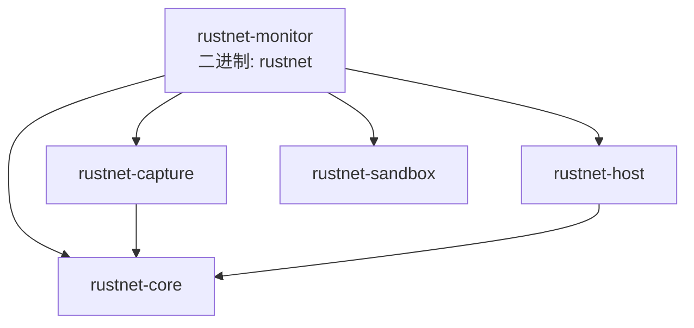
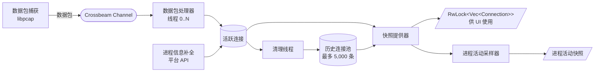

<p align="center"><a href="ARCHITECTURE.md">English</a> | <strong>简体中文</strong></p>

# 架构

本文档描述 RustNet 的技术架构和实现细节。

## 目录

- [Crate 结构](#crate-structure)
- [多线程架构](#multi-threaded-architecture)
- [核心组件](#key-components)
- [平台特定实现](#platform-specific-implementations)
- [性能考量](#performance-considerations)
- [依赖项](#dependencies)
- [安全](#security)

## Crate 结构<a id="crate-structure"></a>

RustNet 是一个由五个 crate 组成的 Cargo 工作区。分析逻辑、捕获后端、进程归属和沙箱各自位于独立的可复用库 crate 中；二进制 crate 将它们组合成 TUI 应用。

| Crate | 类型 | 职责 |
| --- | --- | --- |
| [`rustnet-core`](crates/rustnet-core) | 库 | 与平台和捕获无关的分析核心：数据包解析、协议/连接类型、深度包检测、链路层解析器、连接合并、DNS/GeoIP/OUI 查找、可复用的 `ConnectionTracker`，以及有界的保留进程活动计量。仅操作字节切片和已解析的结构，不依赖 libpcap、原始套接字或操作系统进程表。 |
| [`rustnet-capture`](crates/rustnet-capture) | 库 | 基于 libpcap/Npcap 的数据包捕获后端：设备选择、BPF 过滤器、macOS PKTAP、TUN/TAP，以及原始帧 `PacketReader`。 |
| [`rustnet-host`](crates/rustnet-host) | 库 | 按连接进程归属及主机 TCP/UDP 套接字清单：Linux 上的 eBPF/procfs、macOS 上的 PKTAP/lsof、Windows 上的 ETW/IP Helper，以及 FreeBSD 上的 `sockstat`。负责 eBPF 构建工具链及内置的 `vmlinux.h`。 |
| [`rustnet-sandbox`](crates/rustnet-sandbox) | 库 | 初始化完成后的沙箱与 root 权限降级，统一入口 `apply_sandbox`：Linux 上的 Landlock + 能力降级、macOS 上的 Seatbelt、Windows 上的受限令牌 + 作业对象，以及 Linux/macOS/FreeBSD 共享的 uid 降级。不依赖任何其他工作区 crate。 |
| `rustnet-monitor`（二进制 `rustnet`） | 二进制 | 面向用户的应用：CLI、TUI 和应用事件循环。以 `ConnectionTracker` 作为唯一数据来源（dogfooding）。 |

包名为 `rustnet-monitor`，因为 `rustnet` 这个 crate 名称在 crates.io 上已被占用；安装后的二进制文件名为 `rustnet`。

### 依赖关系图



依赖关系是无环的：`rustnet-core` 没有任何工作区内依赖，`rustnet-capture` 和 `rustnet-host` 都仅依赖它，而 `rustnet-sandbox` 不依赖任何工作区 crate。让 `rustnet-core` 保持为叶子节点，使其可以独立发布和复用 —— 无界面的前端（例如 Prometheus 导出器）可以仅组合 `rustnet-capture` + `rustnet-core` 而无需 TUI；[`examples/headless.rs`](examples/headless.rs) 展示了包含 `rustnet-host` 与 `rustnet-sandbox` 的完整组合。

### 重导出门面

为了将拆分对二进制内部保持透明，`src/network/mod.rs` 重导出 `rustnet_core::network::*` 和 `rustnet_capture`（作为 `capture`），因此现有的 `crate::network::*` 路径、集成测试和基准测试无需改动即可编译。`src/network/platform` 模块如今只是接入 `rustnet-host` 进程与套接字查找的一层薄壳；各平台的接口统计提供者位于 `rustnet-core`（入口 `interface_stats::create_stats_provider`），沙箱与 root uid 降级位于 `rustnet-sandbox`，二进制直接使用这些 crate。

## 多线程架构<a id="multi-threaded-architecture"></a>

RustNet 采用多线程架构以实现高效的数据包处理：



## 核心组件<a id="key-components"></a>

### 1. 数据包捕获线程

使用 libpcap 从网络接口捕获原始数据包。该线程独立运行，将数据包送入 Crossbeam channel 进行处理。

**职责：**
- 打开网络接口进行数据包捕获（非混杂、只读模式）
- 按需应用 BPF 过滤器
- 捕获原始数据包
- 如果启用了 `--pcap-export`，将数据包流式写入 PCAP 文件（直接磁盘写入，无内存缓冲）
- 如果启用了 `--pcapng-export`，将解析后的数据包送入带注释 PCAPNG writer（有界 best-effort 队列）
- 将数据包发送到处理队列

### 2. 数据包处理器

多个工作线程（默认最多 4 个，基于 CPU 核心数）解析数据包并执行深度包检测（DPI）分析。

**职责：**
- 解析 Ethernet、IP、TCP、UDP、ICMP、ARP 头部
- 提取连接五元组（协议、源 IP、源端口、目的 IP、目的端口）
- 执行 DPI 检测应用协议：
  - 带主机信息的 HTTP
  - 带 SNI（Server Name Indication）的 HTTPS/TLS
  - DNS 查询和响应
  - 带版本检测的 SSH 连接
  - 带命令、响应代码、用户名、服务器软件和系统类型的 FTP 控制通道
  - 带 CONNECTION_CLOSE 帧检测的 QUIC 协议
  - 带报文类型、版本和客户端标识符的 MQTT
  - BitTorrent 握手和 DHT 消息
  - WireGuard 和 OpenVPN 隧道流量
  - 用于 WebRTC 和 NAT 穿越的 STUN
  - 带版本、模式和 stratum 的 NTP
  - 用于本地名称解析的 mDNS 和 LLMNR
  - 带消息类型和主机名的 DHCP
  - 带 PDU 类型的 SNMP（v1、v2c、v3）
  - 用于 UPnP 设备发现的 SSDP
  - NetBIOS 名称服务和数据报服务
- 追踪连接状态和生命周期
- 在 DashMap 中更新连接元数据
- 计算带宽指标

### 3. 进程信息补全

使用平台特定的 API 将网络连接与运行中的进程关联。该组件定期运行，为连接数据补充进程信息。

**职责：**
- 将 socket inode 映射到进程 ID
- 解析进程名和命令行
- 用进程信息更新连接记录
- 处理与权限相关的回退

各平台的详情见[平台特定实现](#platform-specific-implementations)。

### 4. 快照提供器

按固定间隔（默认 500ms）创建连接数据的一致快照供 UI 使用。这确保 UI 拥有稳定的连接视图，避免竞争条件。

**职责：**
- 按配置间隔从 DashMap 读取
- 根据用户条件应用过滤（localhost 等）
- 按用户选择的列排序连接
- 为 UI 渲染创建不可变快照
- 为 UI 线程提供 RwLock 保护的 Vec<Connection>

### 5. DNS 归因缓存

`rustnet-core` 中的 `network::dns_attribution::DnsAttributionCache` 是一个由线上观测到的 DNS 响应填充的 `IpAddr -> 最近域名` 映射，由 `ConnectionTracker` 持有（通过 `TrackerConfig::dns_attribution` 开关，默认开启）。当连接没有可用于识别的 SNI / Host 头（握手后的加密 QUIC、纯 TCP、分片的 ClientHello）时，缓存会提供一个从用户刚执行的 DNS 解析推断出的主机名。

该设计是**事件驱动**的：创建时无法归因的连接（尚无新鲜 DNS）会登记到一个以远端 IP 为键的侧索引中，随后到达的匹配 DNS 响应会唤醒这些等待者。没有逐包轮询，也没有定时器。

**数据流：**

```
1. DNS 响应 ──record──► IP→域名 缓存            IP→[ConnectionKey]
                             ▲    │              待归因等待者
                             │    │                  ▲    │
2. 新连接 ──attribute────────┘    │                  │    │ 3. DNS 到达时
      │  命中：写入 attributed_hostname ◄────────────┼──────  排空等待者
      └─ 未命中：登记等待 ───────────────────────────┘

4. 清理线程（每次清扫）：cleanup_tick(now)
    ├─ 清除超过保留期（10 分钟）的缓存条目
    └─ 清除超过 10 秒新鲜窗口的待归因登记

5. 连接移除：forget_pending(remote_ip, key)
```

缓存属性：

- **新鲜窗口**：10 秒，对称地应用于缓存的 `IP -> 域名` 条目（仅当针对远端 IP 的 DNS 响应在此窗口内被观测到时，连接才会被归因）和待归因登记（新的 DNS 解析只会归因在此窗口内建立的连接）。与 Little Snitch 的 `MAX_QUERY_AGE` 一致。
- **保留期**（缓存条目）：10 分钟。更旧的条目会被清除，且永远不用于归因。
- **上限**：缓存最多 8192 个 IP，每个 IP 最多 4 个最近域名，每个 IP 最多 256 个待归因等待者。
- 每个连接**首写生效**：一旦打上标签，就不会被指向同一 IP 的后续解析重新标记。

**热路径开销**：已建立连接的逐包 DNS 查找为零。每个连接只在创建时尝试归因一次，之后每个匹配的 DNS 响应至多再尝试一次。载荷中已携带主机名的连接（通过统一的 `ApplicationProtocol::hostname()` 访问器检查，即 HTTPS 和 QUIC 的 TLS SNI 以及 HTTP `Host:` 头）和归因无意义的协议（DNS、mDNS、LLMNR、DHCP、SSDP、NetBIOS、ARP）在触碰缓存之前就会短路返回。

**竞争安全**：`attribute()` 先把连接登记到待归因索引，然后重查缓存。如果同一 IP 的并发 `record_and_drain_pending()` 恰好落在查找和登记之间，重查会为连接打上标签；此时已过时的登记是无害的，会在连接被清理时由 `forget_pending` 移除，或在新鲜窗口过后由待归因清理移除。

**与 `network::dns::DnsResolver` 的区别**：后者通过系统解析器执行*反向* DNS（IP 到 PTR）；归因缓存则是从观测到的数据包中收集的*正向* DNS（域名到 IP）。两者互补，当两边都有名字时 UI 优先使用归因缓存。

CNAME 链不需要单独的映射：DNS DPI 解析器记录的是原始*问题*名称，应答中的 A/AAAA 记录直接映射到它。在线路层捕获看到的信号比 eBPF 套接字层方案少（除非同时捕获 `lo`，否则看不到应用到 stub 的流量；看不到 D-Bus 解析；看不到 DoH/DoT 明文）；这是已知限制。

### 6. 清理线程

使用智能的、协议感知的超时机制移除不活跃的连接。这防止内存泄漏并保持连接列表的相关性。当启用 `--pcap-export` 时，连接关闭时还会将连接元数据（PID、进程名、时间戳）流式写入 JSONL sidecar 文件。

**超时策略：**

#### TCP 连接
- **HTTP/HTTPS**（通过 DPI 检测）：**10 分钟** —— 支持 HTTP keep-alive
- **SSH**（通过 DPI 检测）：**30 分钟** —— 适应长交互会话
- **普通已建立连接**：**5 分钟**
- **TIME_WAIT**：30 秒（标准 TCP 超时）
- **CLOSED**：15 秒（终止状态归档宽限期）
- **SYN_SENT、FIN_WAIT 等**：30-60 秒

#### UDP 连接
- **HTTP/3（带 HTTP 的 QUIC）**：**10 分钟** —— 连接复用
- **HTTPS/3（带 HTTPS 的 QUIC）**：**10 分钟** —— 连接复用
- **基于 UDP 的 SSH**：**30 分钟** —— 长会话
- **DNS**：**30 秒** —— 短查询
- **普通 UDP**：**60 秒** —— 标准超时

#### QUIC 连接（检测到的状态）
- **已连接**：默认 3 分钟，或当存在对端的 `max_idle_timeout` 传输参数时使用该值
- **带 CONNECTION_CLOSE 帧**：15 秒
- **Initial/Handshaking**：60 秒（允许连接建立）
- **Draining/Closed**：15 秒（终止状态归档宽限期）

终止状态的连接会保留首次进入终止状态的时间戳。重复的关闭流程数据包会更新最终计数器，但不会推迟归档。当新的 TCP SYN 复用正在关闭的连接元组时，清理与数据包摄取会执行一次生命周期安全的转换，将旧代次归档为不可变记录，并创建新的活跃代次。一条有界的 30 秒 tombstone 记录可防止延迟的 TCP 关闭流程数据包生成虚假的已建立连接行。

**视觉陈旧度指示器：**

连接根据距离超时的远近改变颜色：
- **白色**（默认）：< 75% 的超时时间
- **黄色**：75-90% 的超时时间（警告）
- **红色**：> 90% 的超时时间（严重）

### 7. 速率刷新线程

每 500ms 更新带宽计算，采用温和衰减。这提供平滑的带宽可视化，避免突变。

**职责：**
- 计算下载和上传的字节/秒
- 对旧测量值应用指数衰减
- 更新可视化带宽指示器
- 维护包速率的滚动窗口

### 8. DashMap

并发哈希表（`DashMap<ConnectionKey, Connection>`）用于存储连接状态。这种无锁数据结构支持来自多个线程的高效并发访问。

**关键特性：**
- 细粒度锁定（per-shard）
- 无全局锁竞争
- 安全的并发读写
- 高并发负载下的高性能

## 平台特定实现<a id="platform-specific-implementations"></a>

### 进程查找

RustNet 使用平台特定的 API 将网络连接与进程关联。每次归属还会附带有层级上限的父进程链（最多四级祖先，包含 PID、名称、可执行文件路径和启动时间），在 Details 标签页中以进程树展示，并导出到 JSONL。

同一后端每 5 秒为 Host 标签页发布一次套接字快照。该快照独立于数据包捕获，因此可包含尚未产生数据包的 TCP LISTEN 套接字和 UDP BOUND 端点。TCP 状态汇总来自此原生快照，RTT 仍是基于已捕获数据包的观测指标。各平台的实现如下：

#### Linux

**标准模式（procfs）：**
- 解析 `/proc/net/tcp` 和 `/proc/net/udp` 获取 socket inode
- 同时读取 `tcp6`、`udp` 和 `udp6`，并在 Host 快照中保留所有原生 TCP 状态
- 遍历 `/proc/<pid>/fd/` 查找 socket 文件描述符
- 将 inode 映射到进程 ID，并从 `/proc/<pid>/comm` 解析进程名，同时借助可执行文件名恢复被 `comm` 截断的名称
- 从 `/proc/<pid>/` 解析可执行路径、PPID 以及 UID/GID

**eBPF 模式（Linux 默认）：**
- 使用附加到 socket 系统调用的内核 eBPF 程序
- 捕获带进程上下文的 socket 创建事件
- 在 Linux 5.11 及更高版本上，先附加实时探针，再运行一次性的 task-file 迭代器，以捕获 RustNet 启动前已存在的 socket 所有者；使用文件 capabilities 运行时也包括其他用户的 socket
- 比 procfs 扫描开销更低
- 记录进程组组长的 TGID、当前线程的 TID 以及凭据；进程名、可执行路径和 PPID 在用户态通过 procfs 富化
- **局限性：**
  - 进程名来源于内核 16 字符的 `comm` 字段；RustNet 会通过 `/proc/<tgid>/comm` 重新解析，并借助可执行文件名恢复被截断的名称，但在富化前就已退出的进程仍保留 eBPF 记录的短名称
- **Linux capabilities 需求：**
  - 现代 Linux（5.8+）：`CAP_NET_RAW`（包捕获）、`CAP_BPF`、`CAP_PERFMON`（eBPF）
	  - 旧版 Linux（pre-5.8）：eBPF 需要宽泛的 `CAP_SYS_ADMIN`；RustNet 安装包不会自动授予它，并会回退到 procfs
  - 注意：不需要 CAP_NET_ADMIN（使用只读、非混杂包捕获）

**回退行为：**
- 如果 task-file 迭代器不可用，则保留实时 eBPF 追踪，并使用启动时的 procfs 清单
- 如果实时 eBPF 追踪器加载失败，则自动回退到 procfs 模式
- TUI 统计面板显示当前使用的检测方法

#### macOS

**PKTAP 模式（使用 sudo 时）：**
- 使用 PKTAP（Packet Tap）内核接口
- 直接从包元数据提取 PID 和进程名称
- 使用 libproc 补充 PPID、可执行文件路径和有效 UID/GID
- 需要 root 特权（特权内核接口）
- 比 lsof 更快更准确

**lsof 模式（无 sudo 或回退时）：**
- 使用 `lsof -i -n -P -l` 列出网络连接及数字 UID
- 即使 PKTAP 提供数据包进程元数据，Host 标签页仍持续使用 lsof 套接字清单
- 解析输出以将 socket 与进程关联，然后使用 libproc 获取 PPID 和可执行文件路径
- CPU 开销更高，但无需 root
- 当 PKTAP 不可用时自动使用

**检测：**
- TUI 统计面板根据当前方法显示 "pktap" 或 "lsof"
- 自动选择最佳可用方法

#### FreeBSD

- 使用 `sockstat -s` 将 TCP 和 UDP socket 关联到进程并保留原生 TCP 状态
- 使用原生 `KERN_PROC_PID` 和 `KERN_PROC_PATHNAME` sysctl 查询补充
  PPID、有效 UID/GID 和可执行文件路径
- 在每次 socket 表刷新周期内按 PID 缓存进程详情

#### Windows

**ETW + IP Helper API：**
- 为内核网络与进程 provider 启动实时用户 trace session
- 使用包含进程 ID、方向和连接元组的 TCP/UDP 事件
- 缓存连接元组所有权和进程生命周期元数据，使短生命周期进程退出后仍可归属
- 使用 `GetExtendedTcpTable` 和 `GetExtendedUdpTable` 进行校准、补全缓存未命中项，并在 ETW 无法启动时完全回退
- Host 套接字清单复用相同的 IP Helper owner 表，其中包括 TCP LISTEN 和所有已分配的 UDP 端点
- 支持 IPv4 和 IPv6 上的 TCP 与 UDP
- 使用生命周期事件或 `OpenProcess` 和 `QueryFullProcessImageNameW` 解析进程名

**需求：**
- 启动 ETW session 可能需要 Administrator 或 **Performance Log Users（性能日志用户）**组成员身份，具体仍取决于 provider 安全策略
- ETW 失败不会中断捕获；检测模式会变为 `IP Helper`。该模式基于快照，可能遗漏短生命周期进程
- 数据包捕获需要 Npcap，其捕获权限与 ETW 权限相互独立

### 网络接口

该工具使用平台特定的方法自动检测和列出可用网络接口：

- **Linux**：使用 `netlink` 或回退到 `/sys/class/net/`
- **macOS**：使用 `getifaddrs()` 系统调用
- **Windows**：使用 IP Helper API（`GetAdaptersInfo()` 用于列出接口，
  `GetAdaptersAddresses()` 用于获取解析器所需的完整 IPv4/IPv6 本地地址集合）
- **所有平台**：当原生方法失败时回退到 pcap 的 `pcap_findalldevs()`

数据包端点方向判定会维护当前分配给主机的地址快照。数据包处理线程每 30 秒刷新一次；
当两个单播端点都无法识别为本地地址时，还会以限速方式立即刷新，并重新解析该数据包一次。
因此，DHCP 地址变化、VPN 连接、网络漫游以及 IPv6 隐私地址轮换后，流量方向仍能正确判定。
在 Windows 上，`GetAdaptersAddresses()` 会补充 `pnet_datalink` 仅包含 IPv4 的适配器数据，
从而纳入临时和稳定的 IPv6 地址。

### 进程活动计量

`ProcessActivityTracker` 每 500ms 从现有快照提供器接收活跃连接和已保留的历史连接。它按进程身份计算当前速率、60 秒滚动窗口、峰值、保留总计、带宽占比、连接数，以及有界的目的地摘要。

接口统计采集器会为每个接口保留紧凑的 60 秒计数窗口。活动覆盖率会在相同持续时间内比较已捕获的进程字节数与接口字节数，而不是将两个独立采样的瞬时速率相除。

清理线程已将关闭的连接行移入 `ConnectionTracker` 的历史连接池，该池最多保留 5,000 条连接。活动功能直接复用此连接池作为事实来源，不会保留第二份完整连接副本，也不会运行单独的采样线程。活动功能只额外保留紧凑的速率历史、峰值和最新进程快照。每次采样时，超出限制的历史数据会折叠到有界的进程和目的地汇总桶中。

活动标签页与连接界面使用相同的活跃连接和历史连接来源。因此短寿命辅助进程退出后仍然可见，直到对应历史连接被淘汰或用户清除连接。

## 性能考量<a id="performance-considerations"></a>

### 多线程处理

数据包处理分布在多个线程上（默认最多 4 个，基于 CPU 核心数）。这实现了：
- 并行数据包解析和 DPI 分析
- 更好地利用多核系统
- 降低高包速率下的延迟

### 并发数据结构

**DashMap** 提供无锁并发访问，具备：
- Per-shard 锁定（默认 16 个 shard）
- 无全局锁竞争
- 读密集型工作负载优化
- 安全的并发修改

### 批处理

数据包以批次处理以提高缓存效率：
- 上下文切换前处理多个数据包
- 减少系统调用开销
- 更好的 CPU 缓存利用率

### 选择性 DPI

可以使用 `--no-dpi` 禁用深度包检测以降低开销：
- 在高流量网络中降低 20-40% 的 CPU 使用率
- 仍然追踪基本连接信息
- 适用于性能受限的环境

### 可配置间隔

根据需求调整刷新率：
- **UI 刷新**：默认 500ms（可通过 `--refresh-interval` 调整）
- **进程补全**：每 2 秒
- **清理检查**：每 5 秒
- **速率计算**：每 500ms

### 内存管理

**连接清理**防止内存无界增长：
- 协议感知的超时移除陈旧连接
- 移除前的视觉陈旧度警告
- 可配置的超时阈值

**快照隔离**防止 UI 阻塞：
- UI 从不可变快照读取
- 后台线程并发更新 DashMap
- UI 和数据包处理之间无锁竞争

## 依赖项<a id="dependencies"></a>

RustNet 使用以下关键依赖构建：

### 核心依赖

- **ratatui** —— 终端用户界面框架，带完整控件支持
- **crossterm** —— 跨平台终端操作
- **pcap** —— libpcap/Npcap 的包捕获库绑定
- **pnet_datalink** —— 网络接口枚举和低层网络

### 并发与线程

- **dashmap** —— 细粒度锁定的并发哈希表
- **crossbeam** —— 多线程工具和无锁 channel

### 网络与协议

- **dns-lookup** —— DNS 解析能力
- **maxminddb** —— GeoIP 数据库查询（GeoLite2）

### 序列化

- **serde** / **serde_json** —— 事件日志和 PCAP sidecar 的 JSON 序列化

### 命令行与日志

- **clap** —— 带 derive 特性的命令行参数解析
- **simplelog** —— 灵活的日志框架
- **log** —— 日志门面
- **anyhow** —— 错误处理和上下文

### 平台特定

- **procfs**（Linux）— 从 /proc 文件系统获取进程信息（运行时回退）
- **libbpf-rs**（Linux）— eBPF 程序加载和管理
- **landlock**（Linux）— 文件系统和网络沙箱
- **caps**（Linux）— Linux capabilities 管理
- **windows**（Windows）— ETW 和 IP Helper API 的 Windows API 绑定

### 工具库

- **arboard** —— 复制地址的剪贴板访问
- **chrono** —— 日期和时间处理
- **ring** —— 加密操作（用于 TLS/SNI 解析）
- **aes** —— AES 加密支持（用于协议检测）
- **flate2** —— Gzip 解压（用于压缩的嵌入式数据）
- **libc** —— 低层 C 绑定

## 嵌入式数据文件

RustNet 在编译时嵌入静态查找数据库，避免运行时文件依赖。两者遵循相同的模式：嵌入文件，启动时解析为 `HashMap`，暴露 `lookup()` 方法。

### 服务查找（`crates/rustnet-core/assets/services`）

端口到服务名的映射（例如 80/tcp -> http）。由 `crates/rustnet-core/src/network/services.rs` 中的 `ServiceLookup` 使用 `include_str!` 加载。

### OUI 厂商数据库（`crates/rustnet-core/assets/oui.gz`）

IEEE MA-L OUI 前缀到厂商的映射，用于 MAC 地址厂商解析（例如 `00:1B:63` -> Apple）。Gzip 压缩以减小二进制体积（压缩后约 400KB，原始约 1.2MB）。由 `crates/rustnet-core/src/network/oui.rs` 中的 `OuiLookup` 使用 `include_bytes!` + `flate2` 在启动时解压。用于 ARP 连接以及详情页的本地/远程 MAC 行，后者由一个邻居缓存（`crates/rustnet-core/src/network/neighbors.rs`）支撑，该缓存从观察到的 ARP（IPv4）和 NDP（IPv6）流量中被动学习 IP 到 MAC 的映射。ARP 不会跨越路由器，而 NDP 报文仅在跳数限制为 255 时才被信任——这证明其未经过路由（RFC 4861），且分片的 NDP 报文会被完全忽略（RFC 6980），因此缓存只会标注链路内地址（局域网设备和网关），绝不会标注公网远端。

GitHub Action（`.github/workflows/update-oui.yml`）每月从 [IEEE 公开数据库](https://standards-oui.ieee.org/oui/oui.txt) 更新此文件，如有变更则自动打开 PR。

## 安全<a id="security"></a>

关于 Landlock 沙箱、权限需求和威胁模型的安全文档，参见 [SECURITY.zh-CN.md](SECURITY.zh-CN.md)。

## 与同类工具的对比<a id="comparison-with-similar-tools"></a>

网络监控工具存在于从简单连接列表到完整数据包取证的光谱上：

```
简单 ←─────────────────────────────────────────────────────→ 复杂

netstat     iftop     bandwhich     RustNet     tcpdump     Wireshark
   │          │           │            │            │            │
   └── Socket ┴── Bandwidth ──────────┴── Live DPI ┴── Capture ──┴── Forensics
       state      monitoring             + Process     & CLI        & Deep
                                          tracking                   Analysis
```

**RustNet 的定位**：实时连接监控，带 DPI 和进程识别——比带宽监控器功能更强，比取证捕获工具更聚焦。

### 功能对比

| 功能 | RustNet | bandwhich | sniffnet | iftop | netstat | ss | tcpdump/wireshark |
|---------|---------|-----------|----------|-------|---------|-----|-------------------|
| **语言** | Rust | Rust | Rust | C | C | C | C |
| **界面** | TUI | TUI | GUI | TUI | CLI | CLI | CLI/GUI |
| **实时监控** | 是 | 是 | 是 | 是 | 快照 | 快照 | 是 |
| **进程识别** | 是 | 是 | 否 | 否 | 是 | 是 | 否 |
| **深度包检测** | 是 | 否 | 否 | 否 | 否 | 否 | 是 |
| **SNI/主机提取** | 是 | 否 | 否 | 否 | 否 | 否 | 是 |
| **协议状态追踪** | 是 | 否 | 部分 | 否 | 是 | 是 | 是 |
| **逐连接带宽** | 是 | 是 | 是 | 是 | 否 | 否 | 否 |
| **连接过滤** | 是 | 否 | 是 | 是 | 否 | 是 | 是（BPF） |
| **DNS 反向解析** | 是 | 是 | 是 | 是 | 否 | 否 | 是 |
| **GeoIP 查询** | 是 | 否 | 是 | 否 | 否 | 否 | 是 |
| **通知** | 否 | 否 | 是 | 否 | 否 | 否 | 否 |
| **i18n（翻译）** | 否 | 否 | 是 | 否 | 否 | 否 | 否 |
| **跨平台** | Linux、macOS、Windows、FreeBSD | Linux、macOS | Linux、macOS、Windows | Linux、macOS、BSD | 全部 | Linux | 全部 |
| **eBPF 支持** | 是（Linux） | 否 | 否 | 否 | 否 | 是 | 否 |
| **Landlock 沙箱** | 是（Linux） | 否 | 否 | 否 | 否 | 否 | 否 |
| **JSON 事件日志** | 是 | 否 | 否 | 否 | 否 | 否 | 是 |
| **PCAP 导出** | 是（PCAP + sidecar，或带注释 PCAPNG） | 否 | 是 | 否 | 否 | 否 | 是 |
| **数据包捕获** | libpcap | Raw sockets | libpcap | libpcap | Kernel | Kernel | libpcap |

### 工具聚焦领域

- **RustNet**：TUI 中的实时连接监控，带 DPI、协议状态追踪和进程识别
- **bandwhich**：按进程/连接的带宽利用率，开销最小
- **sniffnet**：带图形界面和通知的网络流量分析
- **iftop**：带逐主机流量显示的接口带宽监控
- **netstat/ss**：系统 socket 和连接状态检查（ss 是 Linux 上 netstat 的现代替代品）
- **tcpdump/wireshark/tshark**：用于深度调试的完整数据包捕获和协议分析

### 如何选择合适的工具

| 你的目标 | 最佳工具 |
|-----------|-----------|
| 查看哪个进程正在建立连接 | RustNet |
| 逐字节解码数据包 | Wireshark |
| 监控连接状态（SYN_SENT、ESTABLISHED 等） | RustNet |
| 从流量中提取文件或凭据 | Wireshark |
| 将网络活动归因于特定应用 | RustNet |
| 深度协议解析（3000+ 协议） | Wireshark |
| 快速终端网络概览 | RustNet |
| 保存带进程归因的捕获 | RustNet（`--pcap-export` 或 `--pcapng-export`） |
| 保存捕获用于深度分析 | Wireshark/tcpdump |

### RustNet 与 Wireshark：不同的强项

关键区别：**RustNet 知道每个连接属于哪个进程。Wireshark 不知道。**

Wireshark 在数据包捕获层（libpcap）运行——它看到原始网络流量，但不知道哪个应用创建了它。RustNet 将数据包捕获与 OS 级 socket 内省（通过 Linux eBPF、/proc 或平台 API）相结合，将每个连接归因于其所属进程。

| 能力 | RustNet | Wireshark |
|------------|---------|-----------|
| 进程识别 | 是（eBPF、procfs、平台 API） | 否 |
| 连接状态追踪 | 原生（TCP FSM、QUIC 状态） | 通过解析器 |
| 协议解析器 | ~15 个常见协议 | 3000+ 协议 |
| 数据包级检查 | 仅元数据 | 完整 payload |
| 界面 | TUI（终端） | GUI |
| 捕获到文件 | 是（`--pcap-export`、`--pcapng-export`） | 是（原生） |

两种工具都可以实时运行。根据你想看什么来选择：
- **"是什么在发起这个连接？"** → RustNet
- **"这个数据包里有什么？"** → Wireshark

### 弥合差距：带进程归因的 PCAP 导出

RustNet 现在可以在保留进程归因的同时导出数据包捕获——这是 tcpdump 和 Wireshark 单独都无法做到的：

```bash
# 使用 RustNet 捕获数据包（包含进程追踪）
sudo rustnet -i eth0 --pcap-export capture.pcap

# 创建：
#   capture.pcap                    - 标准 PCAP 文件
#   capture.pcap.connections.jsonl  - 进程归因（PID、名称、时间戳）

# 用进程信息富化 PCAP 并创建注释过的 PCAPNG
python scripts/pcap_enrich.py capture.pcap -o annotated.pcapng

# 或者直接写出带 RustNet 数据包注释的 PCAPNG
sudo rustnet -i eth0 --pcapng-export annotated.pcapng

# 在 Wireshark 中打开 —— 数据包现在显示进程信息注释
wireshark annotated.pcapng
```

这个工作流让你兼得两者之长：
- **RustNet 的进程归因**：知道哪个应用生成了每个数据包
- **Wireshark 的深度分析**：3000+ 解析器的完整协议解析

原生 PCAPNG 导出会直接嵌入实时 best-effort 数据包注释。富化脚本在清理阶段 sidecar 元数据完整性比捕获时生成单个文件更重要时仍然有用。

详见 [USAGE.zh-CN.md - PCAP 导出](USAGE.zh-CN.md#pcap-export)。
